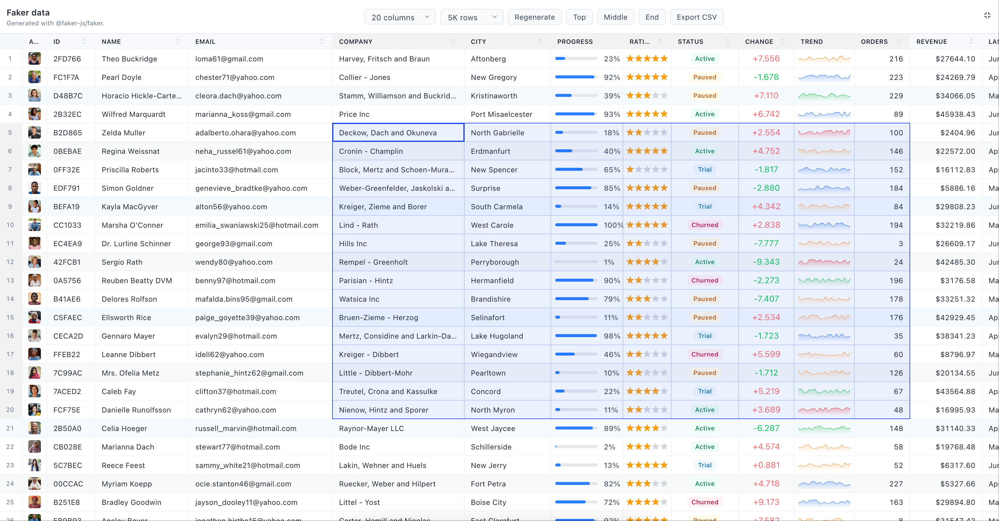

# React Data Grid

A high-performance React data grid component powered by
[`@tanstack/react-virtual`](https://tanstack.com/virtual).



[Live Demo](https://megndu.github.io/react-data-grid/)

## Install

```bash
# TODO Not yet completed
```

## Quick Start

```tsx
import { DataGrid } from 'TODO'
import 'TODO/dist/index.css'

export function Example() {
  const rows = 10000
  const columns = 100

  return (
    <DataGrid
      className="w-[960px] h-[480px] overflow-hidden border-t border-slate-200"
      row={{
        count: rows,
        overscan: 5,
      }}
      column={{
        count: columns,
        overscan: 5,
      }}
      render={(r, c, type) => {
        if (type === 'column') return `Col ${c}`
        if (type === 'row') return `${r}`
        return <span>{c, r}</span>
      }}
    />
  )
}
```

The wrapper element must provide a height. The grid fills the available width
and height of its container.

## Props

| Prop | Type | Description |
| --- | --- | --- |
| `className` | `string` | Extra class name for the outer grid element. |
| `row` | `BaseVirtualizerOptions` | Row virtualizer options. `count` is required. `estimateSize` defaults to `24`. |
| `column` | `BaseVirtualizerOptions` | Column virtualizer options. `count` is required. `estimateSize` defaults to `79`. |
| `render` | `(row, column, type) => ReactNode` | Renders column headers, row headers, and body cells. |
| `borderWidth` | `number` | Grid line width in pixels. Defaults to `1`. |
| `exnted` | `ReactNode` | Optional extra content rendered after the grid container. |

`row` and `column` accept most options from
`ReactVirtualizerOptions<HTMLDivElement, Element>`. The grid owns
`getScrollElement`, `observeElementRect`, `observeElementOffset`,
`scrollToFn`, and `estimateSize` is wrapped so the configured border width is
included in measured cell size.

### `render`

The `render` callback receives a `type` argument:

| Type | Meaning |
| --- | --- |
| `'column'` | Render a column header. `rowIndex` is `0`; `columnIndex` is the column. |
| `'row'` | Render a row header. `rowIndex` is the row; `columnIndex` is `0`. |
| `'cell'` | Render a body cell. Both indexes point to the visible data cell. |

Sorting, formatting, editing, context menus, copy behavior, and CSV export are
intentionally kept outside of the grid. Use the `render` callback and the
imperative ref to compose those behaviors in your application.

### Ref Instance

```tsx
const gridRef = useRef<Instance>(null)

gridRef.current?.row.scrollToIndex(1000)
gridRef.current?.column.scrollToIndex(20)
gridRef.current?.clearSelection()
```

| Field | Description |
| --- | --- |
| `el` | The scrollable grid element. |
| `range` | Current selected range, or `null`. |
| `row` | Row `Virtualizer` instance from `@tanstack/react-virtual`. |
| `column` | Column `Virtualizer` instance from `@tanstack/react-virtual`. |
| `active()` | Returns whether the grid currently has focus. |
| `clearSelection()` | Clears the current cell selection. |

### `Range`

| Field | Description |
| --- | --- |
| `x`, `y` | Pixel position of the selected range. |
| `w`, `h` | Pixel size of the selected range. |
| `tx`, `ty` | Top-left selected cell indexes. |
| `bx`, `by` | Bottom-right selected cell indexes. |

`tx` and `bx` are column indexes. `ty` and `by` are row indexes.

## Development

```bash
pnpm install
pnpm dev
pnpm build
```

`pnpm dev` starts the demo site. `pnpm build` type-checks the project and builds the library output.

# License

[MIT](./LICENSE)
