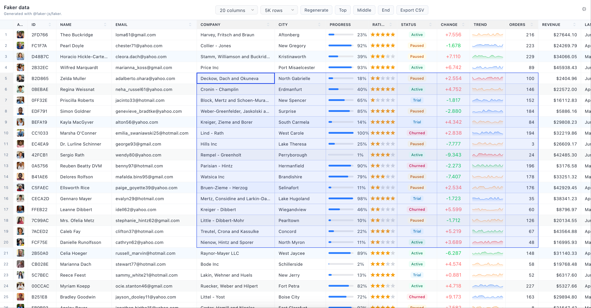

# React Data Grid

A high-performance React data grid component powered by
[`@tanstack/react-virtual`](https://tanstack.com/virtual).



[Live Demo](https://mengdu.github.io/react-data-grid/)

## Install

```bash
npm install @lanyue/react-data-grid
```

## Quick Start

```tsx
import { DataGrid } from '@lanyue/react-data-grid'
import '@lanyue/react-data-grid/dist/index.css'

export function Example() {
  const rows = 10000
  const columns = 100

  return (
    <DataGrid
      className="w-[960px] h-[480px] overflow-hidden border-t border-slate-200"
      row={{
        count: rows,
        overscan: 5,
      }}
      column={{
        count: columns,
        overscan: 5,
      }}
      render={(r, c, type) => {
        if (type === 'column') return `Col ${c}`
        if (type === 'row') return `${r}`
        return <span>{`${c}, ${r}`}</span>
      }}
    />
  )
}
```

The wrapper element must provide a height. The grid fills the available width
and height of its container.

## Props

| Prop | Type | Required | Default | Description |
| --- | --- | --- | --- | --- |
| `className` | `string` | No | - | Extra class name for the outer grid element. |
| `row` | `BaseVirtualizerOptions` | Yes | - | Row virtualizer options. `count` is required; the fallback estimated row height is `24px`. |
| `column` | `BaseVirtualizerOptions` | Yes | - | Column virtualizer options. `count` is required; the fallback estimated column width is `79px`. |
| `rowResize` | `boolean \| ((index: number) => [number, number])` | No | `false` | Enables row resizing, optionally with per-row minimum and maximum heights. |
| `columnResize` | `boolean \| ((index: number) => [number, number])` | No | `false` | Enables column resizing, optionally with per-column minimum and maximum widths. |
| `render` | `(row: number, column: number, type: 'cell' \| 'row' \| 'column') => ReactNode` | Yes | - | Renders column headers, row headers, and body cells. |
| `corner` | `ReactNode` | No | - | Content rendered in the top-left corner header. |
| `borderWidth` | `number` | No | `1` | Grid line width in pixels. |
| `extra` | `ReactNode` | No | - | Extra content rendered inside the outer grid element, after the scrollable grid container. |

`row` and `column` accept most options from
`ReactVirtualizerOptions<HTMLDivElement, Element>`. The grid owns
`getScrollElement`, and wraps `estimateSize` so the configured border width is
included in the virtual item size. `observeElementRect`,
`observeElementOffset`, and `scrollToFn` are optional.

When `rowResize` or `columnResize` is `true`, rows have a minimum height of
`20px` and columns have a minimum width of `40px`, with no maximum. Pass a
function returning `[min, max]` to set bounds for each row or column by index.
Non-finite bounds fall back to the corresponding default; negative minimums
are clamped to `0`, and maximums smaller than the minimum are raised to the
minimum.

### `render`

The `render` callback receives a `type` argument:

| Type | Meaning |
| --- | --- |
| `'column'` | Render a column header. `rowIndex` is `0`; `columnIndex` is the column. |
| `'row'` | Render a row header. `rowIndex` is the row; `columnIndex` is `0`. |
| `'cell'` | Render a body cell. Both indexes point to the visible data cell. |

Sorting, formatting, editing, context menus, copy behavior, and CSV export are
intentionally kept outside of the grid. Use the `render` callback and the
imperative ref to compose those behaviors in your application.

### Ref Instance

```tsx
const gridRef = useRef<Instance>(null)

gridRef.current?.row.scrollToIndex(1000)
gridRef.current?.column.scrollToIndex(20)
gridRef.current?.clearSelection()
```

| Field | Description |
| --- | --- |
| `el` | The scrollable grid element. |
| `range` | Current selected range, or `null`. |
| `row` | Row `Virtualizer` instance from `@tanstack/react-virtual`. |
| `column` | Column `Virtualizer` instance from `@tanstack/react-virtual`. |
| `active()` | Returns whether the grid currently has focus. |
| `clearSelection()` | Clears the current cell selection. |

### `Range`

| Field | Description |
| --- | --- |
| `x`, `y` | Pixel position of the selected range. |
| `w`, `h` | Pixel size of the selected range. |
| `tx`, `ty` | Top-left selected cell indexes. |
| `bx`, `by` | Bottom-right selected cell indexes. |

`tx` and `bx` are column indexes. `ty` and `by` are row indexes.

## Development

```bash
pnpm install
pnpm dev
pnpm build
```

`pnpm dev` starts the demo site. `pnpm build` type-checks the project and builds the library output.

# License

[MIT](./LICENSE)
